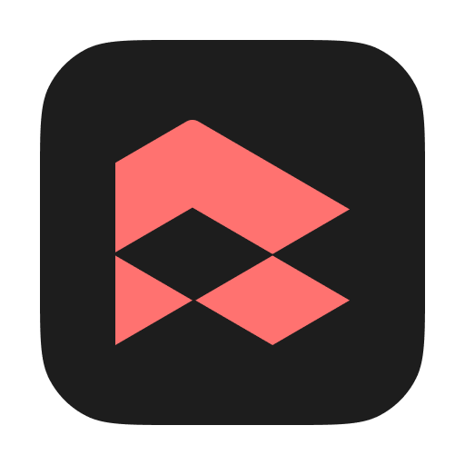

# MiTienda POS

<div align="center">
  
</div>

MiTienda POS es un sistema de punto de venta de código abierto desarrollado con Vue 3, TypeScript, y Electron. Diseñado para pequeños y medianos negocios, ofrece una solución completa para gestionar ventas, inventario, clientes y más.

[](https://opensource.org/licenses/MIT)
[](https://vuejs.org/)
[](https://www.electronjs.org/)

## 🚀 Características

- 💼 **Gestión de ventas**: Procesa ventas rápidamente con interfaz intuitiva
- 📦 **Control de inventario**: Administra productos, categorías y stock
- 🛒 **Órdenes de compra**: Gestiona pedidos a proveedores
- 👥 **Gestión de clientes**: Mantén una base de datos de clientes
- 💰 **Control de caja**: Administra aperturas, cierres y movimientos de caja
- 🏪 **Multitienda**: Soporte para múltiples sucursales
- 📊 **Reportes**: Visualiza el rendimiento de tu negocio
- 🔄 **Funcionamiento offline**: Opera sin necesidad de conexión a internet

## 📋 Módulos

MiTienda POS está organizado en módulos que proporcionan funcionalidades específicas:

### Módulos Frontend (Vue 3)
- **Ventas**: Interfaz de punto de venta y gestión de transacciones
- **Productos**: Administración de inventario y categorías
- **Clientes**: Gestión de información de clientes
- **Proveedores**: Administración de proveedores
- **Órdenes de compra**: Creación y seguimiento de pedidos
- **Cajas**: Control de cajas registradoras y movimientos
- **Reportes**: Visualización de datos y estadísticas
- **Configuración**: Ajustes del sistema

### Módulos Backend (Electron)
- **Productos**: CRUD y gestión de inventario
- **Categorías**: Organización de productos
- **Clientes**: Gestión de base de datos de clientes
- **Proveedores**: Administración de proveedores
- **Ventas**: Procesamiento de transacciones
- **Órdenes de compra**: Gestión de pedidos a proveedores
- **Cajas registradoras**: Control de cajas y auditorías
- **Movimientos de caja**: Registro de entradas y salidas
- **Impuestos**: Configuración de tasas impositivas
- **Descuentos**: Gestión de promociones
- **Vendedores**: Administración de usuarios del sistema
- **Sucursales**: Configuración de múltiples tiendas
- **Configuración**: Ajustes generales del sistema

## 🛠️ Tecnologías

- **Frontend**: 
  - Vue 3 con Composition API
  - TypeScript
  - Pinia para gestión de estado
  - Vue Router
  - TailwindCSS y DaisyUI para UI
  - Vite como bundler

- **Backend**:
  - Electron
  - SQLite3 con Knex.js para base de datos
  - Sistema de módulos para organización del código

## 📥 Instalación

### Requisitos previos
- Node.js (v18 o superior)
- npm (v9 o superior)

### Pasos de instalación

1. Clona el repositorio:
   ```bash
   git clone https://github.com/enrique159/mitienda-pos.git
   cd mitienda-pos
   ```

2. Instala las dependencias:
   ```bash
   npm install
   ```

3. Ejecuta las migraciones de la base de datos:
   ```bash
   npm run migrate:latest
   ```

4. Inicia la aplicación en modo desarrollo:
   ```bash
   npm run dev
   ```

## 🔧 Comandos disponibles

- `npm run dev` - Inicia la aplicación en modo desarrollo
- `npm run build` - Compila la aplicación para producción
- `npm run app:build` - Construye la aplicación Electron para distribución
- `npm run migrate:latest` - Ejecuta las migraciones de base de datos
- `npm run migrate:make` - Crea una nueva migración

## 📦 Compilación para distribución

Para generar los instaladores de la aplicación:

```bash
npm run app:build
```

Esto generará los archivos de instalación en la carpeta `build/`.

## 🤝 Contribuciones

Las contribuciones son bienvenidas. Para contribuir:

1. Haz fork del repositorio
2. Crea una rama para tu característica (`git checkout -b feature/amazing-feature`)
3. Haz commit de tus cambios (`git commit -m 'Add some amazing feature'`)
4. Haz push a la rama (`git push origin feature/amazing-feature`)
5. Abre un Pull Request

## 📄 Licencia

Este proyecto está licenciado bajo la Licencia MIT - ver el archivo [LICENSE](LICENSE) para más detalles.

## 👨‍💻 Autor

Desarrollado por [Enrique Marín Hirales](https://github.com/enrique159)

---

<div align="center">
  <p>¡Hecho con ❤️ para pequeños y medianos negocios!</p>
</div>
